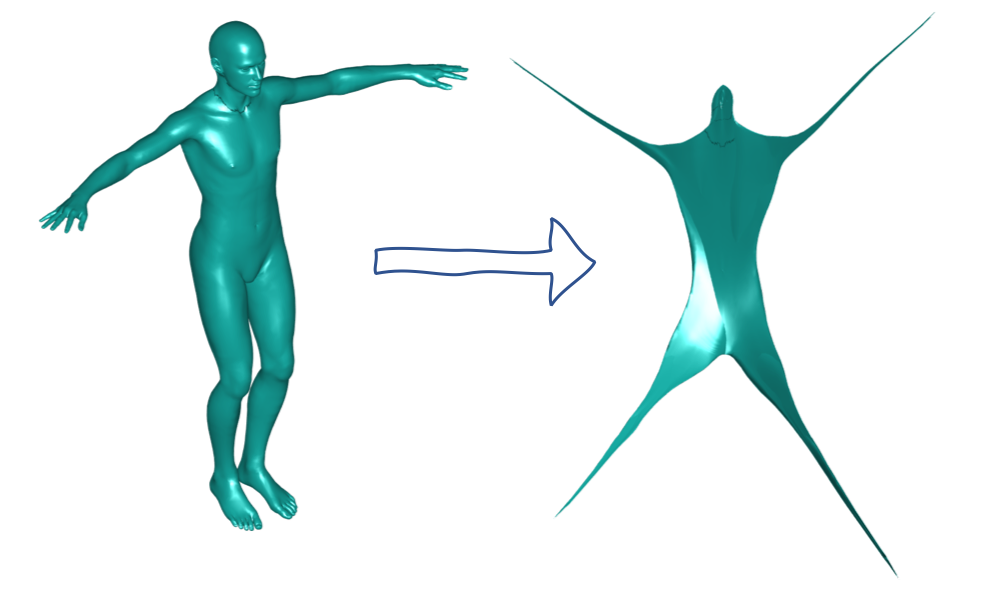

# Fast-Classical-Scaling
[[Paper 1]](https://ieeexplore.ieee.org/abstract/document/8509134) [[Paper 2]]((https://docs.wixstatic.com/ugd/28cd82_86d7ecaa87e34d238200be72c1a69a00.pdf))

A matlab implementation of the paper "Classical scaling revisited". An efficient non-linear dimensionality reduction by approximating the classical scaling method (also known as multidimensional scaling (MDS) or Isomap), using distance interpolation within the subspace of the Laplace Beltrami eigenfunctions.
The code works on 3D triangle meshes, but can be modified to work on graphs of point clouds of any dimension. The graph should be created by connecting near points. In order to modify, one have to calculate the laplace beltrami of a graph.




## Setup & Usage
The project was tested on OSX with Matlab R2019a, and should work on windows 64 as well, to run it: 
1) Download files
2) Run DEMO.m

## Citation
If you use these ideas, please cite the papers (1) <a href="https://ieeexplore.ieee.org/abstract/document/8509134"> Efficient Inter-Geodesic Distance Computation and Fast Classical Scaling</a> and (2) <a href="https://docs.wixstatic.com/ugd/28cd82_91f41197b793480ab25b1f97f10f818a.pdf"> Classical Scaling Revisited </a>:

```
@article{shamai2018efficient,
  title={Efficient Inter-Geodesic Distance Computation and Fast Classical Scaling},
  author={Shamai, Gil and Zibulevsky, Michael and Kimmel, Ron},
  journal={IEEE transactions on pattern analysis and machine intelligence},
  year={2018},
  publisher={IEEE}
}
```

```
@inproceedings{shamai2015classical,
  title={Classical scaling revisited},
  author={Shamai, Gil and Aflalo, Yonathan and Zibulevsky, Michael and Kimmel, Ron},
  booktitle={Proceedings of the IEEE International Conference on Computer Vision},
  pages={2255--2263},
  year={2015}
}
```
